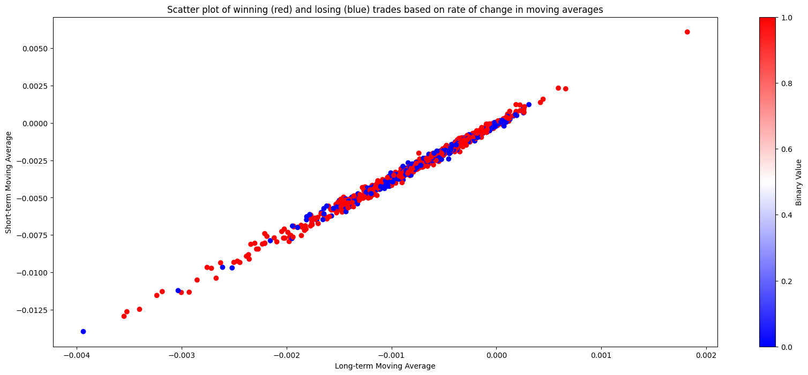

# crossover_classification_backtesting
Continuation of crossover_trading_strategy_backtesting repository with crossover_classification implemented, creates buy signals based on the rate of change at which a shorter and long term moving average of OHCL data cross over. Using a RandomForest classifier on past data, the model classifies the rate of change at which the two moving averages intersect as either a 'buy' or 'no buy' signal on whether the stock will move up a certain percentage within the short term.

## Trading strategy details

Cross-over trading creates buy and sell signals on the intersection of the short-term and long-term moving average of an asset's price. The general idea is that if the 
short-term moving average intersects with the long-term moving average there exists some momentum in the stocks price, either negative or positive. However, when trading based on a crossover strategy, losses still occur when the intersection is short term (e.g. the short-term average only for a few days goes above the long-term average and falls below again triggering a sell for a loss). Thus, it seems that while intersections of moving averages are indicative of an asset's momentum it does not indicate how strong that momentum is and therefore becomes vulnerable to faulty signals from weak momentum intersections. To better indicate the magnitude of momentum for an asset, it would be beneficial to account for the movements coming in the days before and after the intersection, and record the overall rate of change throughout that period. These measures would then hopefully provide a more clear indication of an asset's momentum and prediction of future movement. Plotting each intersection based on the rate of change of 10 trading days centered around the intersection and marking points where 4% was gained within 25 days, it is noticed that when the rate of change in the long-term average is negative at the intersection, it is much more likely that the asset's price will rise above 4% in the next 25 trading days.

