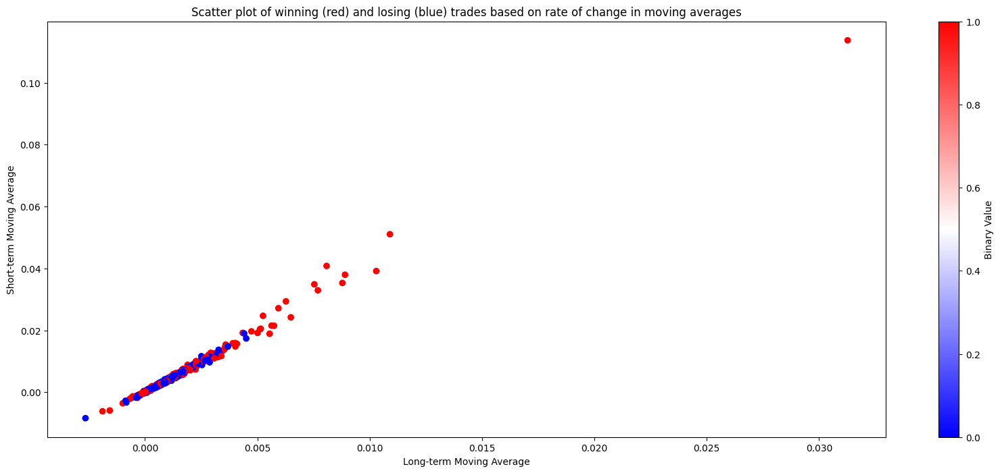

# crossover_classification_backtesting
Continuation of crossover_trading_strategy_backtesting repository with crossover_classification implemented, creates buy signals based on the rate of change at which a shorter and long term moving average of OHCL data cross over. Using a RandomForest classifier on past data, the model classifies the rate of change at which the two moving averages intersect as either a 'buy' or 'no buy' signal on whether the stock will move up a certain percentage within the short term.

## Trading strategy details

Cross-over trading creates buy and sell signals on the intersection of the short-term and long-term moving average of an asset's price. The general idea is that if the 
short-term moving average intersects with the long-term moving average there exists some momentum in the stocks price, either negative or positive. However, when trading based on a crossover strategy, losses still occur when the intersection is short term (e.g. the short-term average only for a few days goes above the long-term average and falls below again triggering a sell for a loss). Thus, it seems that while intersections of moving averages are indicative of an asset's momentum it does not indicate how strong that momentum is and therefore becomes vulnerable to faulty signals from weak momentum intersections. To better indicate the magnitude of momentum for an asset, it would be beneficial to account for the movements coming in the days before and after the intersection, and record the overall rate of change throughout that period. These measures would then hopefully provide a more clear indication of an asset's momentum and prediction of future movement. Plotting each intersection based on the rate of change of 10 trading days centered around the intersection and marking points where 5% was gained within 20 days (hereby referred to as a winning trade), it is noticed that when the rate of change in the long-term average is positive at the intersection, a winning trade is much more likely.

Looking at the plot of positive rates, we observe that as the rate of change in the long-term and short-term average become increasingly positive, the probability of a winning trade increases to a point where beyond a long-term moving average rate of .002, the density of winning trades is significant. 

To better identify this high density region of winning trades, a RandomForest classifier can be used as the model would be able to predict winning trades based on the rate of change in the averages. This model would theoretically be able to identify the higher density region and predict winning trades with a higher confidence. Implementing the classifier, the prediction of winning trades became 83% accurate from the 75% accuracy without a classifier implemented. Thus, trading signals generated by this classifier have a potential to produce effective returns. Training the RandomForest Classifier on data from 100+ commonly traded stocks from 2010-2018, trading is then simulated on a 3 year span of data from late 2020-2023 and the last 9 months from 12/2022 - 9/2023. 

### Mechanism

The strategy is built to buy and sell with Market-on-Open orders (MOO), where a user would run the model after each trading day and set buy and sell MOO orders for the next day according to the signals output. The model reads in pricing data day by day and raises a signal for a trading opportunity when the moving averages have intersected 5 trading days prior. The average rate of change in both the short and long-term moving averages are calculated over 10 days and input as parameters to the RandomForest Classifier that will classify the intersection as a 1 if estimated to gain 5% within the next 20 trading days or 0 if not. A buy signal is then activated if the intersection is classified as a 'Buy' with over 85% confidence (led to ~82% accuracy on test sets). If a buy signal is created, the model buys the stock at Open price th next day and then keeps track of all active positions until they are marked for selling (Price goes 5% over buy price or 20 day hold period ends). Once the sell signal is create the model sells the stock at Open the following day. 

### Results

On average over 30 trainings and simulations, the model gains ~80% over the 4 years from late 2019-2023 and ~15% over the last 9 months 12/2022 - 9/2023. Over the 4 year span, these results outperform the SP500 over the same time period by 32% (gained 48%) as well as outperforming over the last 9 months by 3% (gained 12%). Below is a plot of the portfolio value and movement over the 4 year span with an 87% gain:

